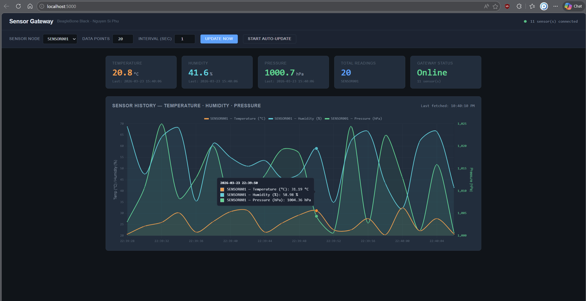

# Sensor Gateway — BeagleBone Black

A TCP-based sensor data gateway running on BeagleBone Black. Collects temperature, humidity, and pressure data from multiple simulated sensor nodes, stores readings in SQLite, and visualizes real-time data via a web dashboard.

Built entirely in C using POSIX APIs to demonstrate Linux system programming skills: socket programming, multi-threading, signal handling, database integration, and REST API design.

## Demo

[](https://youtu.be/lVuCAufhTlo)

> 4-minute demo: gateway startup, 5 sensor nodes, real-time dashboard,
> error handling, graceful shutdown.

## Architecture


## Tech Stack

| Layer | Technology |
|-------|-----------|
| Backend | C — POSIX sockets, pthreads, SQLite3, libmicrohttpd |
| Simulator | C — TCP client, binary packet protocol |
| Frontend | Python Flask + Chart.js (dual Y-axis) |
| Platform | BeagleBone Black, Debian, GCC |
| Tools | Make, Valgrind, Git |

## Binary Packet Protocol

19-byte packed struct transmitted over TCP:

```
Offset  Field        Size   Description
──────  ───────────  ─────  ──────────────────────────────
[0]     start1       1      0xAA — frame sync
[1]     start2       1      0x55 — frame sync
[2-3]   sensor_id    2      uint16_t, network byte order
[4]     dlc          1      13 (payload length)
[5]     data_type    1      0x01 — multi-sensor
[6-9]   temperature  4      IEEE 754 float, °C
[10-13] humidity     4      IEEE 754 float, %
[14-17] pressure     4      IEEE 754 float, hPa
[18]    checksum     1      XOR of bytes [2..17]
```

## Build & Run

### Prerequisites

```bash
sudo apt update
sudo apt install -y gcc make git libsqlite3-dev libmicrohttpd-dev valgrind python3-pip
pip3 install flask requests
```

### Build

```bash
cd backend
make clean && make
```

### Run (3 terminals)

**Terminal 1 — Gateway:**
```bash
cd backend
./gateway
```

**Terminal 2 — Sensor nodes:**
```bash
cd backend
for i in 1 2 3 4 5; do
    ./sensor_node 127.0.0.1 $i &
done
```

**Terminal 3 — Web dashboard:**
```bash
cd frontend
python3 app.py
```

Open browser: `http://localhost:5000` (or `http://<BBB_IP>:5000` from PC)

## REST API Reference

| Method | Endpoint | Description |
|--------|----------|-------------|
| GET | `/api/sensors` | List all sensor IDs |
| GET | `/api/sensors/{id}/data?limit=N` | Get N most recent readings |


## Key Design Decisions

**Thread-per-client model** — Each TCP connection spawns a detached thread. Simple, debuggable, sufficient for 10 concurrent sensors. For 100+ clients, would migrate to epoll + thread pool.

**Binary protocol with checksum** — XOR checksum detects single-bit transmission errors. DLC field enables future protocol extension without breaking backward compatibility.

**Signal handling** — `sigaction()` with only async-signal-safe operations in handler (set flag + close fd). No `fprintf` or `mutex_lock` in signal context.

**LIFO shutdown ordering** — Cleanup reverses initialization order (TCP server → API → storage → log) to prevent use-after-free.

**SQLite WAL mode** — Write-Ahead Logging preferred over default rollback journal for flash storage on BBB. Reduces write amplification and allows concurrent reads during writes.

**Prepared statements** — SQL compiled to bytecode once at init, reused for every query. Catches syntax errors early and eliminates per-request compilation overhead.

**SO_RCVTIMEO for graceful shutdown** — recv() returns periodically (2s timeout) so thread can check shutdown flag. Alternative to poll()/select() — simpler for this use case.

## Error Handling

| Scenario | Behavior |
|----------|----------|
| Sensor disconnects abruptly | Thread detects `recv() == 0`, logs event, cleans up |
| Checksum validation fails | Logs WARNING, skips packet, does not crash |
| SQLite write fails | Logs ERROR, continues receiving data |
| Max connections reached (10) | Rejects new connection with WARNING log |
| SIGINT / SIGTERM received | Graceful shutdown: flush log, close DB, exit 0 |

## Memory Safety

Verified with Valgrind — zero memory leaks, zero errors:

```bash
make valgrind
# valgrind --leak-check=full --track-origins=yes --track-fds=yes ./gateway
```

## Project Structure

```
sensor-gateway/
├── backend/
│   ├── src/
│   │   ├── main.c                  # Entry point, signal handling, init/shutdown
│   │   ├── connection_manager.c/h  # TCP server, thread-per-client, accept loop
│   │   ├── data_manager.c/h        # Binary packet protocol, checksum, validation
│   │   ├── storage_manager.c/h     # SQLite CRUD, thread-safe, prepared statements
│   │   ├── log_process.c/h         # Thread-safe logging, millisecond timestamps
│   │   └── api_server.c/h          # REST API via libmicrohttpd
│   └── Makefile
├── simulator/
│   └── sensor_node.c               # TCP client, sends temp/humidity/pressure
├── frontend/
│   ├── app.py                      # Flask proxy server
│   └── templates/
│       └── index.html              # Chart.js dashboard, dual Y-axis
├── docs/images
│   ├── HLD.md                      # High-Level Design
│   └── LLD.md                      # Low-Level Design
└── README.md
```
## Development Methodology

This project was developed using an AI-assisted workflow:
- **Architecture & design decisions**: Made by the developer based on embedded systems experience (AUTOSAR, CAN protocols, Embedded linux,..)
- **Implementation acceleration**: AI tools used for code generation, debugging assistance, and documentation — reducing development time from ~6 weeks to ~15 days
- **Quality ownership**: Every line of code reviewed, tested on real hardware (BeagleBone Black), and verified with Valgrind (zero memory leaks)
  
## Documentation

- [High-Level Design (HLD)](docs/HLD.md) — System architecture, component descriptions, data flow
- [Low-Level Design (LLD)](docs/LLD.md) — Module internals, data structures, thread model, API specification

## Author

**Nguyen Si Phu** 
