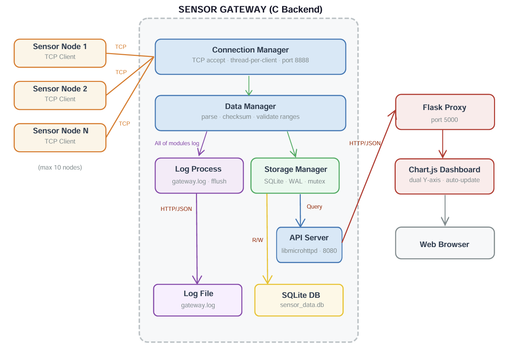
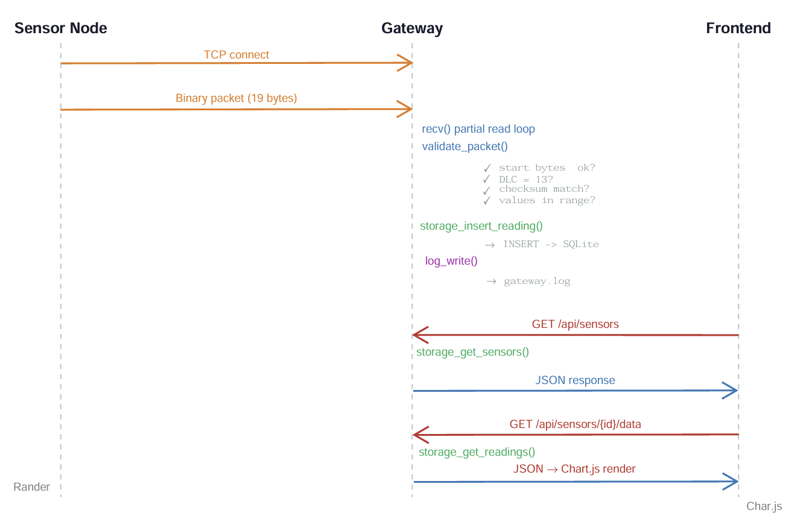
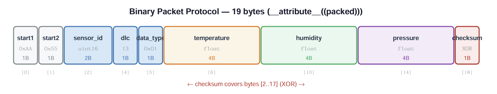
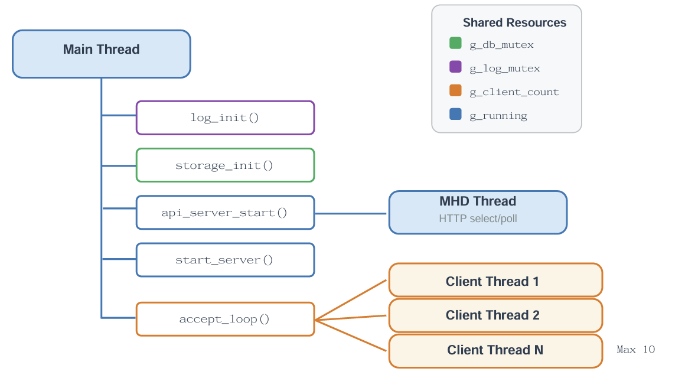
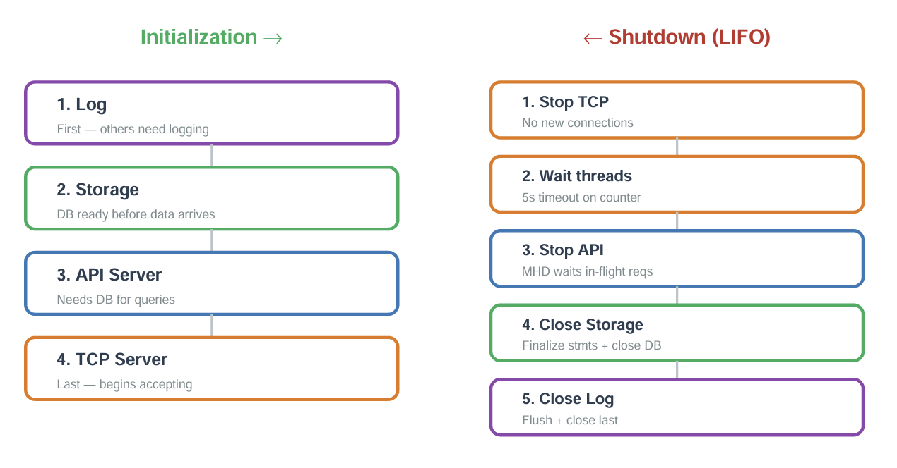

# High-Level Design (HLD) — Sensor Gateway

## 1. Document Overview

This document describes the high-level architecture of the Sensor Gateway system running on BeagleBone Black. It covers system components, their interactions, data flow, and key architectural decisions.

## 2. System Overview

The Sensor Gateway is an end-to-end IoT data collection system that receives sensor data (temperature, humidity, pressure) from multiple simulated sensor nodes via TCP, stores it in SQLite, and visualizes it through a web dashboard.

The system consists of three main subsystems:

- **Sensor Nodes** (Simulator) — Independent TCP clients generating sensor data
- **Sensor Gateway** (Backend) — Central C application handling connections, parsing, storage, logging, and API
- **Web Dashboard** (Frontend) — Flask + Chart.js visualization

## 3. Architecture Block Diagram

## 4. Component Descriptions

### 4.1 Sensor Nodes (Simulator)

Independent C processes running on a separate PC or on the same machine. Each instance simulates one physical sensor, generating randomized but realistic data (temperature 20–35°C, humidity 30–70%, pressure 1000–1025 hPa) and sending it every 2 seconds via TCP using the binary packet protocol.

### 4.2 Connection Manager

Listens on TCP port 8888 and manages the lifecycle of client connections. Uses the thread-per-client model: the main thread runs an `accept()` loop, spawning a detached pthread for each new connection. Enforces a maximum of 10 concurrent connections using an atomic counter. Each client thread runs a partial-read loop to reliably receive complete 19-byte packets.

### 4.3 Data Manager

Stateless module responsible for parsing and validating received binary packets. Performs three-tier validation: frame sync (start bytes 0xAA 0x55), protocol conformance (DLC check), data integrity (XOR checksum), and physical plausibility (value range checks for all three sensor types).

### 4.4 Storage Manager

Manages all SQLite database interactions through a single shared connection protected by a pthread mutex. Uses WAL (Write-Ahead Logging) journal mode optimized for flash storage. All SQL statements are pre-compiled at initialization and reused via `sqlite3_reset()` for efficiency. Provides both write (insert reading) and read (get sensors, get readings) operations for the API layer.

### 4.5 Log Process

Thread-safe logging module writing to `gateway.log` with millisecond-precision timestamps. Uses `pthread_mutex` to serialize file access and `fflush()` after every line to prevent data loss on crash. Format: `[YYYY-MM-DD HH:MM:SS.mmm] [LEVEL] [Module] Message`. Log levels: DEBUG, INFO, WARNING, ERROR.

### 4.6 API Server

HTTP REST API built with libmicrohttpd, running on port 8080 with an internal polling thread. Provides two endpoints: sensor list and historical readings. Returns JSON with CORS headers to allow cross-origin requests from the Flask frontend. Queries storage via the Storage Manager's read functions.

### 4.7 Web Dashboard

Python Flask application serving as both static file server and API proxy. Proxies browser requests to the C API backend, avoiding CORS issues. The HTML frontend uses Chart.js with a dual Y-axis configuration (left: temperature + humidity, right: pressure) and provides auto-update, manual refresh, and sensor selection controls.

## 5. Data Flow

## 6. Communication Protocol

### 6.1 Sensor Node ↔ Gateway: 
TCP + Binary Packet Protocol (19 bytes)

### 6.2 Gateway ↔ Frontend: 
REST API over HTTP
- Transport: HTTP/1.1
- Format: JSON
- Endpoints: `GET /api/sensors`, `GET /api/sensors/{id}/data?limit=N`
- Port: 8080 (C API), 5000 (Flask proxy)

## 7. Thread Model

All client threads are detached. Shared resources protected by mutexes: `g_db_mutex` (storage), `g_log_mutex` (logging). Client count tracked with `atomic_int`.

## 8. Initialization & Shutdown

This LIFO pattern prevents use-after-free: no component accesses a resource that has already been released.

## 9. Non-Functional Requirements

| # | Requirement | Status |
|---|-------------|--------|
| 1 | Throughput ≥ 100 msg/s, latency ≤ 500ms | Design supports it; formal benchmark pending |
| 2 | Stable operation, no crash on errors | Verified: 10 nodes × 10 min, all error paths handled |
| 3 | Clean code, configurable parameters | Modular design, constants via `#define` |
| 4 | Scalable sensor count without architecture change | Thread-per-client scales to ~50; beyond needs epoll |
| 5 | Zero memory leaks, zero resource leaks | Verified with Valgrind (`--leak-check=full --track-fds=yes`) |
| 6 | Intuitive frontend | Dark theme dashboard, dropdown, value cards, auto-update |
| 7 | Smooth chart updates | Chart.js with limit=50, no lag |
| 8 | Cross-browser compatibility | Vanilla JS + Chart.js CDN, tested Chrome/Firefox |
