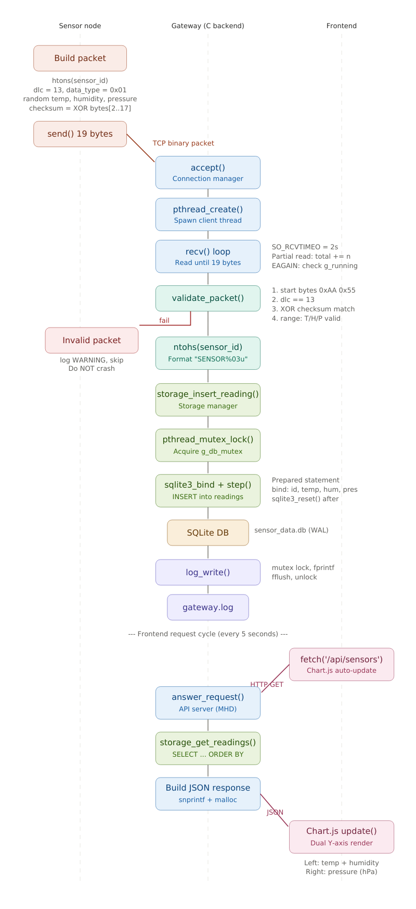

# Low-Level Design (LLD) — Sensor Gateway

## 1. Document Overview

This document describes the low-level design of each module in the Sensor Gateway system: data structures, function signatures, thread safety model, error handling, and implementation details.

### Runtime Overview



The sections below detail each module shown in this flow.

## 2. Module: Data Manager

### 2.1 Purpose

Defines the binary packet protocol and provides parsing/validation functions. This module is shared between the gateway and the sensor node simulator.

### 2.2 Data Structures

```c
/* 19 bytes — __attribute__((packed)) ensures no padding */
typedef struct {
    uint8_t  start1;        /* 0xAA — frame sync byte 1 */
    uint8_t  start2;        /* 0x55 — frame sync byte 2 */
    uint16_t sensor_id;     /* Network byte order (htons) */
    uint8_t  dlc;           /* Data Length Code = 13 */
    uint8_t  data_type;     /* 0x01 = multi-sensor */
    float    temperature;   /* IEEE 754, °C */
    float    humidity;      /* IEEE 754, % */
    float    pressure;      /* IEEE 754, hPa */
    uint8_t  checksum;      /* XOR of bytes [2..17] */
} __attribute__((packed)) SensorPacket;
```

### 2.3 Constants

| Constant | Value | Description |
|----------|-------|-------------|
| `START_BYTE_1` | 0xAA | Frame delimiter byte 1 |
| `START_BYTE_2` | 0x55 | Frame delimiter byte 2 |
| `PACKET_SIZE` | 19 | Total packet size in bytes |
| `DATA_TYPE_TEMP` | 0x01 | Multi-sensor payload type |
| `CHECKSUM_OFFSET` | 2 | Byte offset where checksum calculation starts |
| `CHECKSUM_LEN` | 16 | Number of bytes included in checksum |

### 2.4 Functions

**`uint8_t calculate_checksum(const uint8_t *data, int len)`**

XOR all bytes in the given buffer. Pure function, no side effects. Used by both gateway (verification) and simulator (packet construction).

**`int validate_packet(const SensorPacket *pkt)`**

Four-tier validation:
1. **Frame sync** — `start1 == 0xAA && start2 == 0x55`
2. **Protocol conformance** — `dlc == 13`
3. **Data integrity** — Computed checksum matches `pkt->checksum`
4. **Physical plausibility** — Temperature [-40, 125]°C, Humidity [0, 100]%, Pressure [800, 1200] hPa

Returns 1 if valid, 0 if any check fails. Logs specific failure reason to stderr.

### 2.5 Design Rationale

Why XOR checksum instead of CRC: XOR is O(n) single-pass with no lookup table. Sufficient for detecting single-bit errors on a local network. The protocol is not designed for cryptographic integrity.

Why `__attribute__((packed))`: Ensures the struct layout matches the exact byte sequence on the wire. Without packing, the compiler may insert padding bytes between fields, causing the struct size to differ from the protocol specification.

Why `htons`/`ntohs` for sensor_id only: Float values are not converted to network byte order because both sender and receiver run on the same architecture (ARM/x86 little-endian). In a heterogeneous deployment, float serialization would need explicit handling.

---

## 3. Module: Connection Manager

### 3.1 Purpose

Manages the TCP server lifecycle and client connections using the thread-per-client model.

### 3.2 Data Structures

```c
typedef struct {
    int      fd;                    /* Client socket file descriptor */
    char     ip[INET_ADDRSTRLEN];   /* Client IP address string */
    uint16_t port;                  /* Client port number */
} ClientInfo;
```

Heap-allocated before `pthread_create()`. The thread takes ownership and calls `free()` on exit. Stack allocation would cause a race condition: `accept_loop()` may overwrite the stack variable before the thread reads it.

### 3.3 Constants

| Constant | Value | Description |
|----------|-------|-------------|
| `SERVER_PORT` | 8888 | TCP listen port |
| `MAX_CLIENTS` | 10 | Maximum concurrent connections |
| `BACKLOG` | 5 | `listen()` backlog queue size |

### 3.4 Functions

**`int start_server(void)`**

Creates TCP socket with `SO_REUSEADDR`, binds to `INADDR_ANY:8888`, starts listening. Returns server file descriptor on success, -1 on failure.

**`void accept_loop(int server_fd)`**

Blocking loop that accepts new connections. For each connection: checks client count against `MAX_CLIENTS` (atomic), allocates `ClientInfo`, spawns detached thread running `handle_client()`. Exits when `g_running` becomes 0 or `accept()` returns `EBADF` (server fd closed by signal handler).

**`static void *handle_client(void *arg)`** (internal)

Thread function for one client. Sets `SO_RCVTIMEO = 2s` for graceful shutdown support. Runs a partial-read loop (`while (total < PACKET_SIZE)`) to handle TCP fragmentation. On complete packet: calls `validate_packet()`, then `storage_insert_reading()`. Decrements atomic client counter on exit.

**`void stop_server(int server_fd)`**

Closes server socket, then busy-waits (100ms intervals, 5s timeout) for all client threads to exit by checking atomic counter.

### 3.5 Thread Safety

- `g_client_count`: `atomic_int` — lock-free increment/decrement from multiple threads
- `g_running`: `volatile sig_atomic_t` — set by signal handler, read by all threads
- No mutex needed in this module — atomics suffice for counter operations

### 3.6 Recv Strategy

```
Outer loop: while (g_running)
    Inner loop: while (total < PACKET_SIZE)
        n = recv(fd, buf + total, PACKET_SIZE - total, 0)
        if n > 0: total += n, continue
        if n == 0: peer closed → goto done
        if EAGAIN/EWOULDBLOCK: timeout → check g_running → retry
        if EINTR: signal → check g_running → retry
        else: real error → goto done
    validate + store packet
```

This handles TCP fragmentation (partial reads), timeouts (for shutdown), and signal interrupts.

---

## 4. Module: Storage Manager

### 4.1 Purpose

SQLite database interface providing thread-safe insert and query operations.

### 4.2 Database Schema

```sql
CREATE TABLE IF NOT EXISTS readings (
    id          INTEGER PRIMARY KEY AUTOINCREMENT,
    sensor_id   TEXT    NOT NULL,
    timestamp   DATETIME DEFAULT CURRENT_TIMESTAMP,
    temperature REAL    NOT NULL,
    humidity    REAL    NOT NULL,
    pressure    REAL    NOT NULL
);
```

### 4.3 Data Structures

```c
typedef struct {
    char   timestamp[32];   /* "YYYY-MM-DD HH:MM:SS" */
    double temperature;
    double humidity;
    double pressure;
} SensorReading;
```

### 4.4 Prepared Statements

| Statement | SQL | Purpose |
|-----------|-----|---------|
| `g_stmt_insert` | `INSERT INTO readings (sensor_id, temperature, humidity, pressure) VALUES (?, ?, ?, ?)` | Write sensor data |
| `g_stmt_get_sensors` | `SELECT DISTINCT sensor_id FROM readings ORDER BY sensor_id` | List unique sensors |
| `g_stmt_get_readings` | Subquery: inner `ORDER BY DESC LIMIT ?`, outer `ORDER BY ASC` | Get N most recent readings in chronological order |

The subquery pattern for `get_readings` is necessary because `ORDER BY ASC LIMIT N` returns the N oldest records, not the N newest. The inner query selects the N newest (DESC), and the outer query reverses them to chronological order for Chart.js.

### 4.5 Functions

**`int storage_init(void)`**

Opens SQLite with `SQLITE_OPEN_FULLMUTEX`, enables WAL mode, creates table, prepares all statements. Returns 0 on success, -1 on failure.

**`int storage_insert_reading(uint16_t sensor_id, float temperature, float humidity, float pressure)`**

Formats sensor_id as "SENSOR%03u", binds parameters, executes INSERT. Thread-safe via `g_db_mutex`.

**`int storage_get_sensors(char ***sensors, int *count)`**

Returns array of sensor ID strings. Caller must free each string and the array. Thread-safe.

**`int storage_get_readings(const char *sensor_id, int limit, SensorReading **readings, int *count)`**

Pre-allocates array of `limit` SensorReadings, fills from query results. Caller must free the array. Thread-safe.

**`void storage_close(void)`**

Finalizes all prepared statements, closes database, destroys mutex. Must be called after API server stops to prevent queries on a closed database.

### 4.6 Thread Safety Model

Single `pthread_mutex_t g_db_mutex` protects all database operations. Both reads and writes acquire the same mutex because SQLite prepared statements have internal state — concurrent `sqlite3_step()` on the same statement would crash.

### 4.7 Memory Ownership

| Function | Allocates | Caller Frees |
|----------|-----------|--------------|
| `storage_get_sensors` | `char **` array + each `char *` via `strdup` | `free(sensors[i])` + `free(sensors)` |
| `storage_get_readings` | `SensorReading *` array via `malloc` | `free(readings)` |
| `storage_insert_reading` | None (uses prepared statement) | N/A |

---

## 5. Module: Log Process

### 5.1 Purpose

Thread-safe logging with millisecond-precision timestamps.

### 5.2 Log Format

```
[2026-03-16 10:30:01.123] [INFO   ] [ConnMgr] New connection from 192.168.1.10:54321
[2026-03-16 10:30:01.456] [WARNING] [DataMgr] Checksum fail sensor_id=5
[2026-03-16 10:30:02.789] [ERROR  ] [StorageMgr] INSERT failed: database is locked
```

### 5.3 Log Levels

| Level | Usage |
|-------|-------|
| `LOG_DEBUG` | Detailed per-packet info, disabled in production |
| `LOG_INFO` | Normal operations: start, stop, connect, disconnect |
| `LOG_WARNING` | Non-critical: checksum fail, max clients reached |
| `LOG_ERROR` | Critical: DB failure, socket error |

### 5.4 Functions

**`int log_init(void)`** — Opens `gateway.log` in append mode. Returns 0 on success.

**`void log_write(LogLevel level, const char *module, const char *fmt, ...)`** — Acquires mutex, formats timestamp via `clock_gettime(CLOCK_REALTIME)` + `localtime_r()`, writes to file + stdout, calls `fflush()`, releases mutex.

**`void log_close(void)`** — Writes final log message *before* acquiring mutex (avoids deadlock with non-recursive mutex), then flushes and closes file.

### 5.5 Design Decisions

Why `clock_gettime` instead of `gettimeofday`: Both work, but `clock_gettime` is the modern POSIX API. `gettimeofday` is deprecated in POSIX.1-2008.

Why `localtime_r` instead of `localtime`: `localtime` uses a static buffer — not thread-safe. `localtime_r` writes to a caller-provided buffer. Classic interview question about thread safety.

Why `fflush` after every line: Without fflush, stdio buffers (4–8KB) hold data in memory. On crash or SIGKILL, buffered data is lost. With fflush, data reaches the kernel buffer immediately. Critical for post-crash debugging.

Why mutex instead of FIFO + separate process: The original design specified a shared queue with a dedicated log process. This was simplified to direct function calls + mutex because throughput is ~5 logs/second — the mutex block time (<1ms per call) is negligible. A ring buffer + writer thread would be the next step if log throughput becomes a bottleneck.

---

## 6. Module: API Server

### 6.1 Purpose

REST API layer providing HTTP endpoints for the frontend to query sensor data.

### 6.2 Endpoints

**`GET /api/sensors`**

Returns JSON array of all unique sensor IDs:
```json
{"sensors": ["SENSOR001", "SENSOR002", "SENSOR003"]}
```

**`GET /api/sensors/{id}/data?limit=N`**

Returns N most recent readings for the specified sensor (default 50, max 500):
```json
{
  "sensor_id": "SENSOR001",
  "readings": [
    {"timestamp": "2026-03-16 10:30:01", "temperature": 23.50, "humidity": 47.20, "pressure": 1012.30}
  ]
}
```

### 6.3 Implementation Details

**Routing**: String comparison on URL prefix. Two endpoints do not justify a regex engine or routing table. If scaling to 10+ endpoints, a routing table would be appropriate.

**JSON construction**: `snprintf` into a buffer. Simple response structures do not justify adding a JSON library dependency (e.g., cJSON). For complex nested responses, a library would be recommended.

**CORS**: `Access-Control-Allow-Origin: *` header on all responses. Required because the Flask frontend (port 5000) makes requests to the C API (port 8080) — different origins trigger browser Same-Origin Policy.

**Memory**: Sensor list uses a 4KB stack buffer (sufficient for 64 sensors × ~20 bytes). Reading list uses heap allocation (`count × 150 + 256` bytes) because 500 readings could reach ~75KB — risky for libmicrohttpd worker thread stack.

### 6.4 libmicrohttpd Configuration

`MHD_USE_INTERNAL_POLLING_THREAD`: libmicrohttpd creates one internal thread running a `select()`/`poll()` loop. Sufficient for the expected load (~1 request per 5 seconds). Alternatives: `MHD_USE_THREAD_PER_CONNECTION` or `MHD_USE_EPOLL` for higher throughput.

---

## 7. Module: Sensor Node (Simulator)

### 7.1 Purpose

Simulates physical sensor hardware for testing. Each instance represents one independent sensor node.

### 7.2 Usage

```
./sensor_node <gateway_ip> <sensor_id>
./sensor_node 192.168.1.100 1
```

### 7.3 Data Generation

| Metric | Range | Unit |
|--------|-------|------|
| Temperature | 20.0 – 35.0 | °C |
| Humidity | 30.0 – 70.0 | % |
| Pressure | 1000.0 – 1025.0 | hPa |

Random seed: `time(NULL) ^ sensor_id` — ensures different instances produce different sequences.

### 7.4 Packet Construction

```
1. Fill start bytes (0xAA, 0x55)
2. Set sensor_id with htons() (host → network byte order)
3. Set dlc = 13, data_type = 0x01
4. Generate random temperature, humidity, pressure
5. Calculate XOR checksum over bytes [2..17]
6. send() entire 19-byte packet
7. sleep(2) seconds
8. Repeat
```

---

## 8. Frontend: Web Dashboard

### 8.1 Flask Proxy (app.py)

Routes:
- `GET /` → Serve `index.html`
- `GET /api/sensors` → Proxy to `http://127.0.0.1:8080/api/sensors`
- `GET /api/sensors/<id>/data` → Proxy with query parameters forwarded

Why proxy instead of direct browser-to-API: Single origin (port 5000) eliminates CORS configuration in the browser. Also enables future additions like caching, rate limiting, and authentication.

### 8.2 Dashboard (index.html)

**Chart.js Configuration:**
- Type: line chart with 3 datasets
- Left Y-axis: Temperature (°C) + Humidity (%) — similar numeric ranges
- Right Y-axis: Pressure (hPa) — order of magnitude higher
- X-axis: time scale using date-fns adapter
- Auto-update: `setInterval` with configurable period (default 5s)

**UI Components:**
- Sensor dropdown with selection persistence across updates
- 5 stat cards: Temperature, Humidity, Pressure, Total Readings, Gateway Status
- Dark theme inspired by industrial SCADA/HMI interfaces

---

## 9. Error Handling Summary

| Module | Error | Response |
|--------|-------|----------|
| Connection Mgr | `accept()` fails | Log ERROR, continue accept loop |
| Connection Mgr | Max clients reached | Reject with `close()`, log WARNING |
| Connection Mgr | `recv()` returns 0 | Client disconnected, cleanup thread |
| Connection Mgr | `recv()` real error | Log ERROR, cleanup thread |
| Data Manager | Invalid start bytes | Log to stderr, return 0 |
| Data Manager | Checksum mismatch | Log to stderr, return 0 |
| Data Manager | Value out of range | Log to stderr, return 0 |
| Storage Mgr | `sqlite3_open` fails | Log ERROR, return -1, gateway exits |
| Storage Mgr | INSERT fails | Log ERROR, return -1, caller continues |
| Storage Mgr | Query fails | Log ERROR, return -1 |
| API Server | `MHD_start_daemon` fails | Log ERROR, return -1, gateway exits |
| API Server | DB query fails | Return HTTP 500 with JSON error |
| Log Process | `fopen` fails | Return -1, gateway exits |
| Main | Any init fails | Log ERROR, cleanup in reverse order, exit |

---
